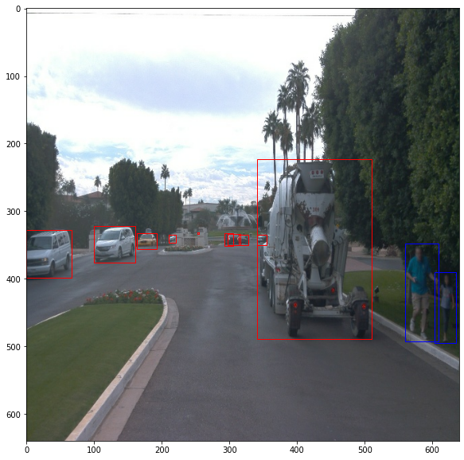
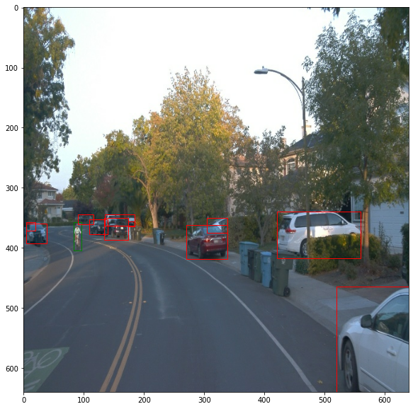
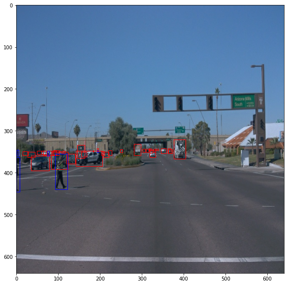
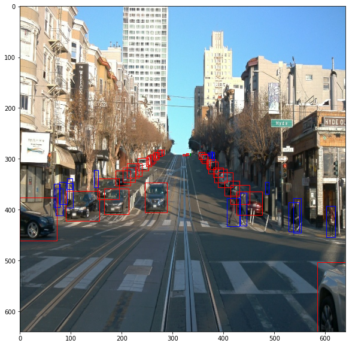
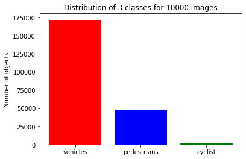
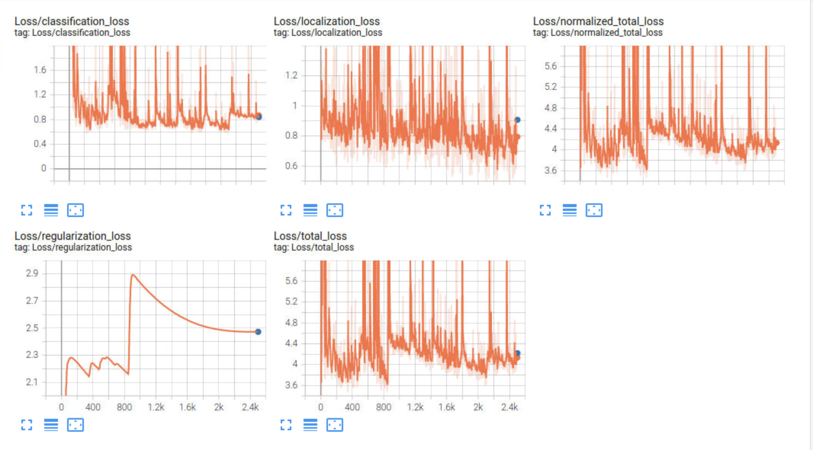

# Object Detection in an Urban Environment

## Project overview

In this project, with the help of TensorFlow Object Detection API we have trained a SSD ResNet 50 model to detect and classify objects using data from Waymo. The image dataset consists of urban environments containing annotated cyclists, pedestrians and vehicles.

First, an extensive data analysis is performed including the computation of label distributions, display of sample images, and checking for object occlusions. Then a reference model is trained as a baseline to compare and further improve the model. The data analysis is used to decide what augmentations are meaningful for improving the performance and then applied to the neural network. TensorBoard is used to monitor the training and evaluation process. Finally, a script is provided to create a short video of the model predictions.

## Structure

### Data

The data you will use for training, validation and testing is organized as follow:
```
/data/
    - train: contain the train data (87 files)
    - val: contain the val data (10 files)
    - test - contains 3 files to test your model and create inference videos
```

The folders contains file that have been downsampled: we have selected one every 10 frames from 10 fps videos. The `testing` folder contains frames from the 10 fps video without downsampling.

If you donwload data from Waymo, you can use `create_splits.py` file to create the splits. As I have used the Udacity workspace, I have used the already splitted data. 

### Experiments
The experiments folder is organized as follows:
```
experiments/
    - exporter_main_v2.py - to create an inference model
    - model_main_tf2.py - to launch training
    - reference/ - reference training with the unchanged config file
    - exp_1/ - added data augmentation techniques
    - exp_2/ - tuned optimization parameters 
    - label_map.pbtxt
```

## Set up and instructions

### Data

For this project, we will be using data from the [Waymo Open dataset](https://waymo.com/open/).

[OPTIONAL] - The files can be downloaded directly from the website as tar files or from the [Google Cloud Bucket](https://console.cloud.google.com/storage/browser/waymo_open_dataset_v_1_2_0_individual_files/) as individual tf records. We have already provided the data required to finish this project in the repository, so you don't need to download it separately.


### Local Setup

For local setup if you have your own Nvidia GPU, you can use the provided Dockerfile and requirements in the [build directory](./build).

Follow [the README therein](./build/README.md) to create a docker container and install all prerequisites.

### Download and process the data

The first goal of this project is to download the data from the Waymo's Google Cloud bucket to your local machine. For this project, we only need a subset of the data provided (for example, we do not need to use the Lidar data). Therefore, we are going to download and trim immediately each file. In `download_process.py`, you can view the `create_tf_example` function, which will perform this processing. This function takes the components of a Waymo Tf record and saves them in the Tf Object Detection api format. An example of such function is described [here](https://tensorflow-object-detection-api-tutorial.readthedocs.io/en/latest/training.html#create-tensorflow-records). We are already providing the `label_map.pbtxt` file.

You can run the script using the following command:
```
python download_process.py --data_dir {processed_file_location} --size {number of files you want to download}
```

You are downloading 100 files (unless you changed the `size` parameter) so be patient! Once the script is done, you can look inside your `data_dir` folder to see if the files have been downloaded and processed correctly.


### Create the training - validation splits
In the class, we talked about cross-validation and the importance of creating meaningful training and validation splits. For this project, you will have to create your own training and validation sets using the files located in `/home/workspace/data/waymo`. The `split` function in the `create_splits.py` file does the following:
* create three subfolders: `/home/workspace/data/train/`, `/home/workspace/data/val/`, and `/home/workspace/data/test/`
* split the tf records files between these three folders by symbolically linking the files from `/home/workspace/data/waymo/` to `/home/workspace/data/train/`, `/home/workspace/data/val/`, and `/home/workspace/data/test/`

Use the following command to run the script once your function is implemented:
```
python create_splits.py --data-dir /home/workspace/data
```

### Edit the config file

Now you are ready for training. As we explain during the course, the Tf Object Detection API relies on **config files**. The config that we will use for this project is `pipeline.config`, which is the config for a SSD Resnet 50 640x640 model. You can learn more about the Single Shot Detector [here](https://arxiv.org/pdf/1512.02325.pdf).

First, let's download the [pretrained model](http://download.tensorflow.org/models/object_detection/tf2/20200711/ssd_resnet50_v1_fpn_640x640_coco17_tpu-8.tar.gz) and move it to `/home/workspace/experiments/pretrained_model/`.

We need to edit the config files to change the location of the training and validation files, as well as the location of the label_map file, pretrained weights. We also need to adjust the batch size. To do so, run the following:
```
python edit_config.py --train_dir /home/workspace/data/train/ --eval_dir /home/workspace/data/val/ --batch_size 2 --checkpoint /home/workspace/experiments/pretrained_model/ssd_resnet50_v1_fpn_640x640_coco17_tpu-8/checkpoint/ckpt-0 --label_map /home/workspace/experiments/label_map.pbtxt
```
A new config file has been created, `pipeline_new.config`.

### Training

You will now launch your very first experiment with the Tensorflow object detection API. Move the `pipeline_new.config` to the `/home/workspace/experiments/reference` folder. Now launch the training process:
* a training process:
```
python experiments/model_main_tf2.py --model_dir=experiments/reference/ --pipeline_config_path=experiments/reference/pipeline_new.config
```
Once the training is finished, launch the evaluation process:
* an evaluation process:
```
python experiments/model_main_tf2.py --model_dir=experiments/reference/ --pipeline_config_path=experiments/reference/pipeline_new.config --checkpoint_dir=experiments/reference/
```

**Note**: Both processes will display some Tensorflow warnings, which can be ignored. You may have to kill the evaluation script manually using
`CTRL+C`.

To monitor the training, you can launch a tensorboard instance by running `python -m tensorboard.main --logdir experiments/reference/`. You will report your findings in the writeup.


### Creating an animation
#### Export the trained model
Modify the arguments of the following function to adjust it to your models:

```
python experiments/exporter_main_v2.py --input_type image_tensor --pipeline_config_path experiments/reference/pipeline_new.config --trained_checkpoint_dir experiments/reference/ --output_directory experiments/reference/exported/
```

This should create a new folder `experiments/reference/exported/saved_model`. You can read more about the Tensorflow SavedModel format [here](https://www.tensorflow.org/guide/saved_model).

Finally, you can create a video of your model's inferences for any tf record file. To do so, run the following command (modify it to your files):
```
python inference_video.py --labelmap_path label_map.pbtxt --model_path experiments/reference/exported/saved_model --tf_record_path /data/waymo/testing/segment-12200383401366682847_2552_140_2572_140_with_camera_labels.tfrecord --config_path experiments/reference/pipeline_new.config --output_path animation.gif
```


## Dataset
### Dataset analysis
|   |   |
|   |   |

For the exploratory data analysis, I have shuffled and taken 10000 random images. The images are taken in varied conditions, weather and places. The class distribution is below: 

    

As we can see, the dataset is quite imbalanced with very low count of cyclists. If we look further into the object distributions within images, we find the distribution for cyclists is very skewed where less than 900 images contain at least one cyclist. The distributions show that the dataset mostly contains vehicles and pedestrians in the images. Over 60k images contain at least 5 vehicles where maximum number of vehicles is 60+

    
    
    


## Training
### Reference experiment

    
    
The reference model, defined in [pipeline_new.config](https://github.com/zmruhi1/udacity-dsnd-object-detection/tree/main/experiments/reference/pipeline_new.config) file, is trained for 2500 steps with a SGD with momentum optimizer. As we can see in the image above, the loss graphs are fluctuating a lot. The reason could be the small batch size of 2. The final evaluated total loss is 4.22 hence the model still needs modifications to improve the performance. The training loss and evaluation loss is quite close, therefore we can say there's no overfitting or underfitting present; the splitted dataset is the optimal splitting point for further experiments. 

### Experiment 1 
#### With augmentations 
    

